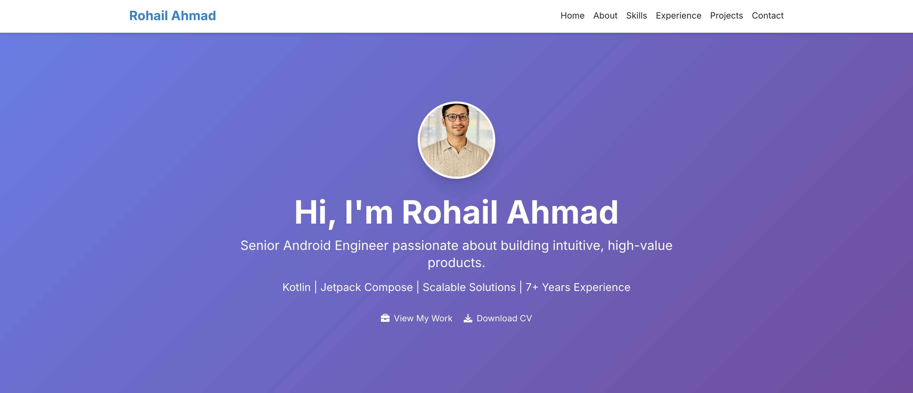

# My Personal Portfolio Website

This repository contains the complete source code for my personal portfolio website, designed to showcase my skills, experience, and projects as a Senior Android Engineer. The site is built with modern web technologies and features a clean, responsive design.

**Live Demo:** [**https://www.rrohaill.dev/**](https://www.rrohaill.dev/) 

---


[**https://www.rrohaill.dev/**](https://www.rrohaill.dev/)

## ✨ About The Project

This portfolio was created to be a central hub for my professional identity. It's a place where I can present my journey as a software developer, highlight my technical expertise, and provide a curated look at the projects I'm most proud of. The goal was to build a site that is not only informative but also visually appealing and easy to navigate.

### Key Features:

* **Fully Responsive Design:** Looks great on all devices, from mobile phones to desktops.
* **Structured Sections:** Clear and concise sections for an introduction (Hero), About Me, Skills, Career Journey, and Featured Projects.
* **Modern Aesthetics:** Uses a clean layout, a professional font (Inter), and tasteful animations and hover effects.
* **Easy to Customize:** Built with standard HTML and Tailwind CSS, making it straightforward for other developers to adapt for their own use.
* **Contact Information:** Provides clear links to my professional profiles and email for easy contact.

## 🚀 Tech Stack

This project is built using a modern, lightweight tech stack focused on performance and ease of maintenance:

* **[HTML5](https://developer.mozilla.org/en-US/docs/Web/Guide/HTML/HTML5):** For the core structure and content.
* **[Tailwind CSS](https://tailwindcss.com/):** A utility-first CSS framework for rapid and responsive UI development. All styling is handled directly in the HTML via utility classes.
* **[JavaScript](https://developer.mozilla.org/en-US/docs/Web/JavaScript):** For interactivity, including the mobile navigation menu and smooth scrolling.
* **[Font Awesome](https://fontawesome.com/):** Used for the icons throughout the site.
* **[Google Fonts](https://fonts.google.com/):** Specifically, the 'Inter' font family is used for clean and readable typography.

## 🛠️ Getting Started

To get a local copy up and running, follow these simple steps.

### Prerequisites

You only need a modern web browser to view the project.

### Installation & Usage

1.  **Clone the repository:**
    ```sh
    git clone [https://github.com/your-username/your-repo-name.git](https://github.com/your-username/your-repo-name.git)
    ```
2.  **Navigate to the project directory:**
    ```sh
    cd your-repo-name
    ```
3.  **Open the `index.html` file in your browser:**
    * You can simply double-click the `index.html` file, or right-click and choose "Open with" your preferred browser.

## 🎨 How to Customize for Your Own Use

This portfolio is designed to be easily adapted. If you'd like to use it as a template for your own portfolio, here’s how to customize it:

1.  **Personal Information (Hero Section):**
    * Open `index.html`.
    * In the `<section id="home">`, change the name in the `<h1>` tag and the tagline in the `<p>` tags.
    * Update the `href` in the "Download CV" button to point to your own resume file.

2.  **Profile Picture:**
    * Add your profile picture to the main project folder (e.g., `my-photo.jpg`).
    * In the `<section id="home">` and `<section id="about">`, find the `` tags and change the `src` attribute from `IMG-20240504-WA0095.jpg` to the filename of your photo.

3.  **About Me & Hobbies:**
    * In the `<section id="about">`, edit the paragraphs (`<p>`) and the list items (`<li>`) under "Hobbies" with your own information.

4.  **Skills:**
    * In the `<section id="skills">`, find the skill cards. You can change the names of skills, add new list items (`<li>`), or remove ones you don't need. You can find more icons to use from [Font Awesome](https://fontawesome.com/icons).

5.  **Career Journey (Experience):**
    * In the `<section id="experience">`, each job is a `<div class="card ...">`. Copy, edit, or remove these blocks to match your career history. Update the job title, company name, dates, and your list of achievements.

6.  **Featured Projects:**
    * In the `<section id="projects">`, each project is also a `<div class="card ...">`.
    * Update the project title, description, and the list of technologies (`<span class="tag">`).
    * Change the `href` for the "View on Play Store" or "View Code" links to point to your own projects.
    * Replace the placeholder project images by changing the `src` attribute in the `` tags.

7.  **Contact & Social Links:**
    * In the `<section id="contact">`, update the `mailto:` link with your email address.
    * Change the `href` attributes for the social media icons (LinkedIn, GitHub, etc.) to your own profile URLs.

## 📄 License

This project is licensed under the MIT License. See the `LICENSE` file for more details.

Project Link: [https://github.com/rrohaill/portfolio-website](https://github.com/rrohaill/rrohaill.github.io) 

## 🙏 Acknowledgements

* [Tailwind CSS](https://tailwindcss.com/)
* [Font Awesome](https://fontawesome.com/)
* [Google Fonts](https://fonts.google.com/)
* [placehold.co](https://placehold.co/) for placeholder images.
